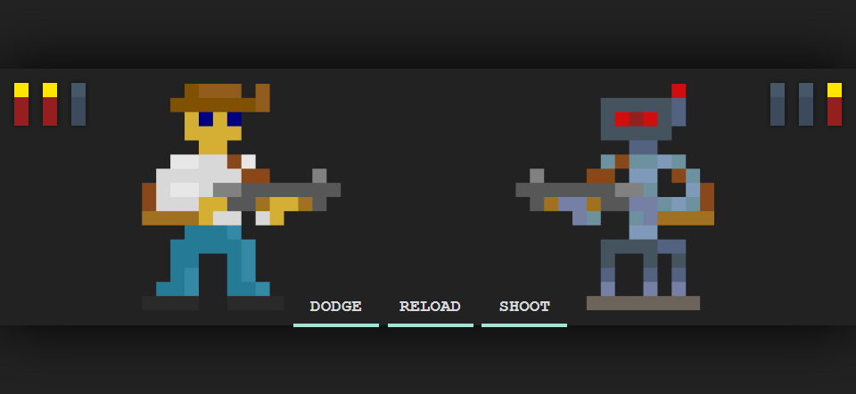

<h1 align="center">SHOTGUN</h1>

Shotgun is a game that is very similar to _"rock, paper, scissors"_, but allows the player to choose between _"dodge, reload, shoot"_. In this game you fight versus a robot super intelligence; See if you can beat it one on one!

When reaching max ammo you may choose _**"shotgun"**_, the ultimate attack! This attack wins you the round even if the opponent _dodges_ or _shoots_.

## Play now!

The game is available over at **GitHub Pages** here:  
### [https://jillejr.github.io/Shotgun/](https://jillejr.github.io/Shotgun/)

---

## Credits

All pixel art, design and programming is done by [Kalle "Jag" Jillheden](https://github.com/jilleJr) as a school assignment from [Nackademin](https://nackademin.se).

Used libraries:
- [jQuery](https://jquery.com/) by The jQuery Foundation.

## Assignment specs

:ballot_box_with_check: Ammo count conveyed clearly.  
:ballot_box_with_check: Can not shoot without any loaded shells.  
:ballot_box_with_check: Robot player can not shoot without shells.  
:ballot_box_with_check: The player who won is displayed together with a button to play again.  
:ballot_box_with_check: The library jQuery must be used somewhere in the solution.  
:ballot_box_with_check: Code shall follow OOP paradigm, as well as run without errors.
